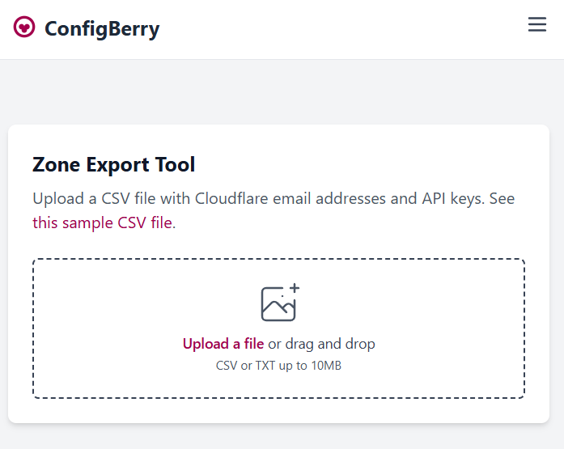
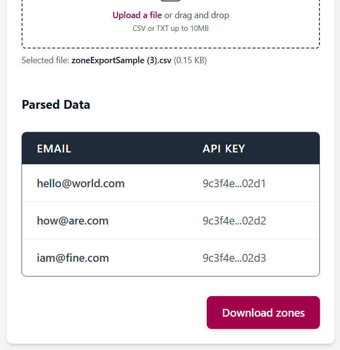

Let me show you how to easily pull down a list of all your Cloudflare zones from multiple accounts.

## Zone Export Tool

Go to this [free, online tool](/export-zones) I built, called the Zone Export Tool.

## Prepare the data

The tool requires a CSV file containing your Cloudflare account emails and API keys. I've created a [sample template](/zoneExportSample.csv) that you can use as a starting point.

If you're unsure where to get this information from - check out [this post](./cloudflare-zone-api-credentials).

## Upload your CSV file

Upload your prepared CSV file into the tool. You'll then get a preview of the data.

## Download the zone list

After you click the download button, the tool will call the Cloudflare API, and generate a CSV file containing all zones associated with the provided accounts.

## Conclusion

And that's it! You now have a complete list of all your Cloudflare zones across multiple accounts.

Check out the [WAF Sync Tool](./copy-cloudflare-waf-rules) if you wanted to use this to copy WAF security rules across all of the downloaded zones.
