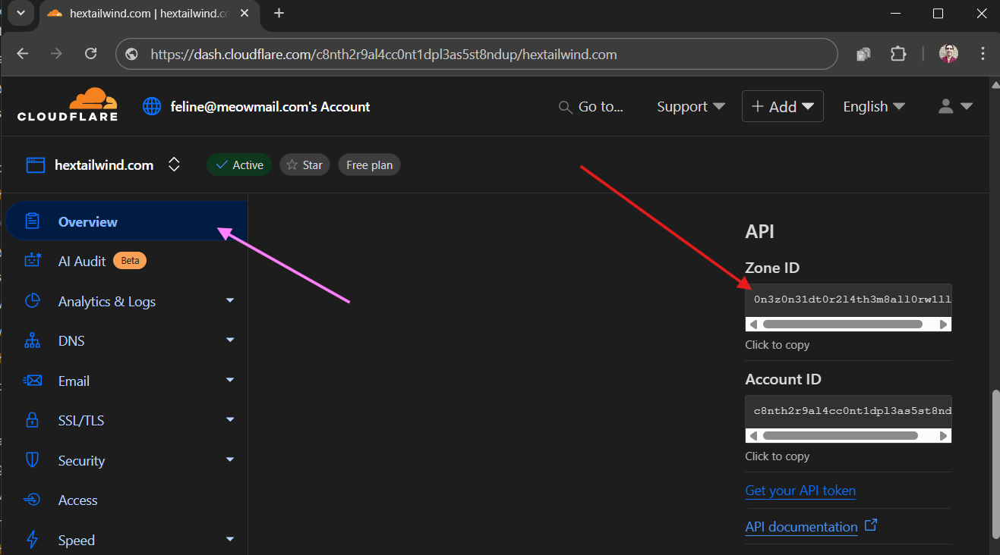
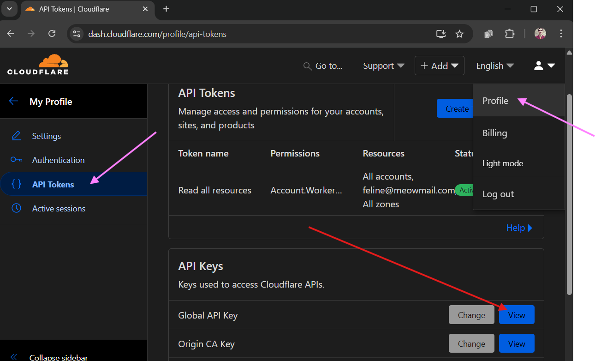

So you want to automate your Cloudflare settings? Whether you're managing multiple domains or just tired of clicking through the dashboard, the Cloudflare API is your ticket to faster, more efficient workflows. Here's the quickest way to get everything you need.

## The Fast Track: What You Need

To start making API calls to Cloudflare, you need three essential pieces:

- Zone ID
- API email
- API key

Here's how to grab them in record time:

## Zone ID

1. Log into Cloudflare
2. Select your domain
3. On the "Overview" page, scroll down until you see the API section in the right sidebar. There you can find the Zone ID.



## API email

The API email is the email you used to log into Cloudflare. Simple!

## API key

1. Click your profile icon (top right)
2. Go to Profile / API Tokens
3. Click "View" to see your Global API Key



With these three pieces, you're ready to roll! Here's a quick example you can run in Git Bash to test your setup:

```bash
curl -X GET "https://api.cloudflare.com/client/v4/zones/YOUR_ZONE_ID/dns_records" \
     -H "X-Auth-Email: YOUR_API_EMAIL" \
     -H "X-Auth-Key: YOUR_API_KEY" \
     -H "Content-Type: application/json"
```

## API tokens

Experts reading this will point out that Cloudflare is encouraging users to [migrate away
from the API key](https://developers.cloudflare.com/fundamentals/api/get-started/keys/#limitations). That’s absolutely correct — API keys are considered legacy authentication and come with a number of limitations, such as being tied to a specific user account and lacking granular permission controls.

Cloudflare recommends using API tokens instead, which are generally more secure. However, you need to invest a little bit of time
setting up the tokens' access rights.

## Copying firewall rules across multiple domains

If you're looking for a quick way to copy Cloudflare WAF security rules across multiple domains - check out the [WAF Sync Tool](./copy-cloudflare-waf-rules) on this site. All you need are the API credentials for the zones where you want to perform the copy / paste. Read [this blog post](./copy-cloudflare-waf-rules) to see how it works.
